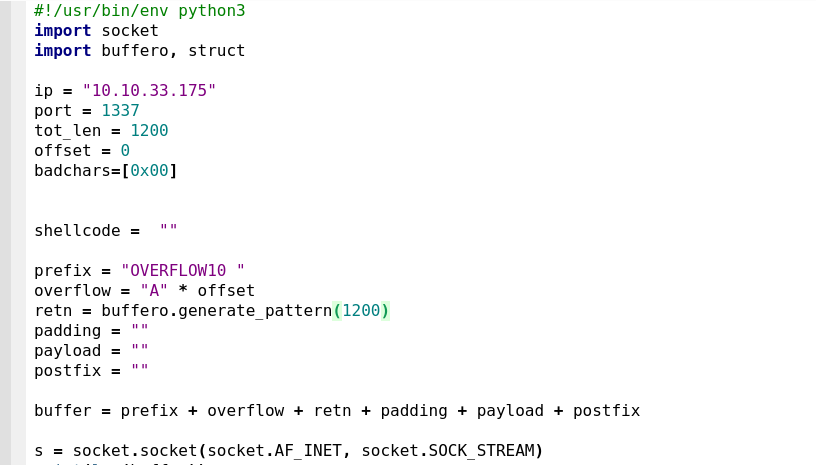

# How to use buffero

1. Fuzzing the target to cause Segmentation fault.
2. Generate cyclic pattern to send the remote app, instead of bunch of A's.

3. Determine the offset
4. Create Bad Character list to determine Bad Chars. Retry again while no more bad characters remained
5. Generate Shellcode with MSFVenom
6. Put it together.
7. Spawn a Shell
